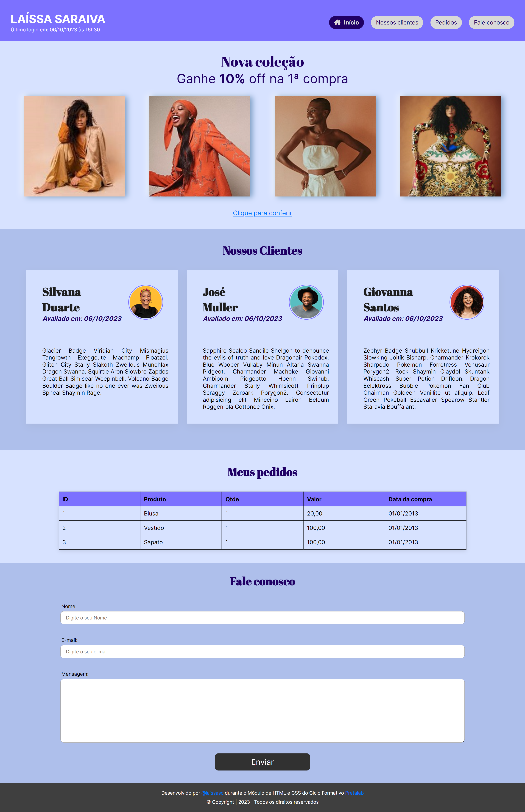

# Aula Prática HTML e CSS - Ciclo Formativo PretaLab 👩🏾‍💻

## Objetivo
Colocar em prática os conceitos de HTML e Css visto durante as aulas Semanais através de uma página de uma loja virtual.

### [Figma](https://www.figma.com/file/LtbRAU9Mmtly2yHpKAfcvU/Untitled?node-id=0%3A82&mode=dev)

### Versão Mobile
;

### Versão Desktop

Imagens:
Imagem de <a href="https://br.freepik.com/fotos-gratis/desenho-de-colagem-de-pessoas_12976945.htm#query=people%20image&position=0&from_view=search&track=ais">Freepik</a>